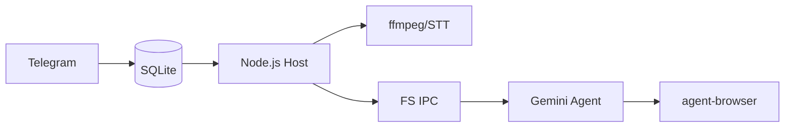

<p align="center">
  
</p>

<p align="center">
  Asistente de IA personal impulsado por <strong>Gemini CLI</strong>. Se ejecuta de forma segura en contenedores. Ligero y diseñado para ser entendido y personalizado.
</p>

<p align="center">
  <em>Fork de <a href="https://github.com/gavrielc/nanoclaw">NanoClaw</a>: se reemplazó el SDK de agente de Claude por Gemini CLI y WhatsApp por Telegram</em>
</p>

<p align="center">
  <a href="README.md">English</a> |
  <a href="README.zh-TW.md">繁體中文</a> |
  <a href="README.zh-CN.md">简体中文</a> |
  <strong>Español</strong> |
  <a href="README.ja.md">日本語</a>
</p>

## ¿Por qué NanoGemClaw?

**NanoGemClaw** es un asistente de IA ligero, seguro y personalizable que ejecuta **Gemini CLI** en contenedores aislados.

| Característica | NanoClaw | NanoGemClaw |
|----------------|----------|-------------|
| **Motor de Agente** | Claude Agent SDK | Gemini CLI |
| **Mensajería** | WhatsApp (Baileys) | Telegram Bot API |
| **Costo** | Claude Max ($100/mes) | Nivel gratuito (60 req/min) |
| **Soporte Multimedia** | Solo texto | Fotos, Voz, Audio, Video, Documentos |
| **Navegación Web** | Solo búsqueda | `agent-browser` completo (Playwright) |
| **Herramientas Avanzadas** | - | STT, Gen. de Imágenes, Webhooks |

---

## 🚀 Funciones Principales

- **E/S Multimodal** - Envía fotos, mensajes de voz, videos o documentos. Gemini los procesa de forma nativa.
- **Voz a Texto (STT)** - Los mensajes de voz se transcriben y analizan automáticamente.
- **Generación de Imágenes** - Pide al agente que cree imágenes usando **Imagen 3**.
- **Automatización del Navegador** - Los agentes usan `agent-browser` para tareas web complejas (interacción, capturas).
- **Seguimiento de Tareas** - Rastrea y gestiona tareas de fondo complejas de varios pasos.
- **Personalización de Persona** - Define la personalidad y el comportamiento de tu bot vía `/admin persona`.
- **Soporte i18n** - Soporte completo de interfaz para inglés, chino, japonés y español.
- **Aislamiento por Contenedores** - Cada grupo se ejecuta en su propio sandbox (Apple Container o Docker).

---

## 🛠️ Instalación

### Requisitos Previos

| Herramienta | Propósito | Instalación |
|-------------|-----------|-------------|
| **Node.js 20+** | Motor de lógica | [nodejs.org](https://nodejs.org) |
| **Gemini CLI** | Núcleo del Agente | `npm install -g @google/gemini-cli` |
| **FFmpeg** | Proceso de audio | `brew install ffmpeg` (Requerido para STT) |

### Inicio Rápido

1. **Clonar e Instalar:**

   ```bash
   git clone https://github.com/Rlin1027/NanoGemClaw.git
   cd NanoGemClaw
   npm install
   ```

2. **Configurar el Bot:**
   - Obtén un token de **@BotFather** en Telegram.
   - Crea un archivo `.env` basado en `.env.example`.
   - Ejecuta `npm run setup:telegram` para verificar.

3. **Construir y Ejecutar:**

   ```bash
   cd container && ./build.sh && cd ..
   npm run dev
   ```

---

## 📖 Ejemplos de Uso

### Mensajería y Productividad

- `@Andy traduce este mensaje de voz y resúmelo`
- `@Andy genera una imagen 16:9 de una ciudad ciberpunk futurista`
- `@Andy navega en https://news.google.com y dime los titulares principales`

### Automatización de Tareas

- `@Andy cada mañana a las 8am, revisa el clima y sugiere qué vestir`
- `@Andy monitorea mi sitio web y envía una notificación webhook si se cae`

---

## ⚙️ Administración

Envía estos comandos directamente al bot:

- `/admin language <lang>` - Cambia el idioma de la interfaz.
- `/admin persona <name>` - Cambia la personalidad del bot.
- `/admin report` - Obtén un resumen de actividad diaria.

---

## 🏗️ Arquitectura



- **Host (Node.js)**: Maneja la API de Telegram, conversión STT y ciclo de vida de contenedores.
- **Contenedor (Alpine)**: Ejecuta Gemini CLI. Accede a internet vía `agent-browser`. Aislado del host.
- **Persistencia**: SQLite para turnos/tareas; JSON para sesiones/estado.

---

## 🛠️ Solución de Problemas

- **¿El bot no responde?** Revisa `npm run logs` y asegúrate de que el bot sea administrador.
- **¿Falla el STT?** Asegúrate de tener `ffmpeg` instalado en tu sistema host (`brew install ffmpeg`).
- **¿No procesa multimedia?** Verifica que tu `GEMINI_API_KEY` esté configurada en `.env`.
- **¿Problemas con el contenedor?** Ejecuta `./container/build.sh` para asegurar la última imagen.
