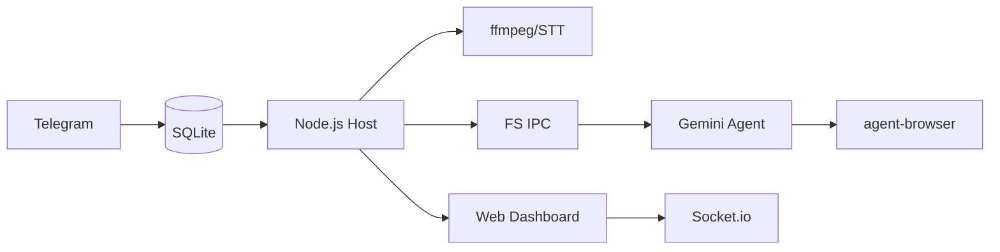

<p align="center">
  
</p>

<p align="center">
  <strong>Gemini CLI</strong> で動作する個人用AIアシスタント。コンテナ内で安全に実行。軽量で理解しやすく、カスタマイズ可能。
</p>

<p align="center">
  <em><a href="https://github.com/gavrielc/nanoclaw">NanoClaw</a> からフォーク - Claude Agent SDK を Gemini CLI に、WhatsApp を Telegram に置き換え</em>
</p>

<p align="center">
  <a href="README.md">English</a> |
  <a href="README.zh-TW.md">繁體中文</a> |
  <a href="README.zh-CN.md">简体中文</a> |
  <a href="README.es.md">Español</a> |
  <strong>日本語</strong>
</p>

## なぜ NanoGemClaw？

**NanoGemClaw** は、隔離されたコンテナ内で **Gemini CLI** を実行する、軽量で安全、かつカスタマイズ可能な AI アシスタントです。

| 機能 | NanoClaw | NanoGemClaw |
|------|----------|-------------|
| **エージェントランタイム** | Claude Agent SDK | Gemini CLI |
| **メッセージング** | WhatsApp (Baileys) | Telegram Bot API |
| **コスト** | Claude Max ($100/月) | 無料枠 (60リクエスト/分) |
| **メディアサポート** | テキストのみ | 写真、音声、オーディオ、動画、ドキュメント |
| **Web 閲覧** | 検索のみ | フル `agent-browser` (Playwright) |
| **高度なツール** | - | STT, 画像生成, Webhooks, Web ダッシュボード |

---

## 🚀 主な機能

- **マルチモーダル I/O** - 写真、ボイスメッセージ、動画、ドキュメントを送信。Gemini がネイティブに処理します。
- **音声文字起こし (STT)** - ボイスメッセージを自動的に文字起こしし、エージェントが分析します。
- **画像生成** - **Imagen 3** を使用して画像を生成するようエージェントに依頼できます。
- **ブラウザ自動化** - エージェントは `agent-browser` を使用して、複雑な Web タスク（操作、スクリーンショット）を実行します。
- **マルチターンタスク追跡** - 複雑な多段階のバックグラウンドタスクを追跡・管理します。
- **パーソナリティのカスタマイズ** - `/admin persona` を介して、ボットの性格や動作を定義できます。
- **多言語サポート (i18n)** - 日本語、繁体字中国語、簡体字中国語、英語、スペイン語をフルサポート。
- **コンテナ分離** - すべてのグループは独自のサンドボックス（Apple Container または Docker）で実行されます。
- **Web ダッシュボード** - リアルタイム監視コマンドセンター。ログストリーミング、プロンプトエディター、システム設定管理を搭載。LAN アクセス対応。

---

## 🛠️ インストール

### 前提条件

| ツール | 用途 | インストール |
|--------|------|--------------|
| **Node.js 20+** | ロジックエンジン | [nodejs.org](https://nodejs.org) |
| **Gemini CLI** | AI エージェントコア | `npm install -g @google/gemini-cli` |
| **FFmpeg** | オーディオ処理 | `brew install ffmpeg` (STT に必要) |

### クイックスタート

1. **Clone とインストール：**

   ```bash
   git clone https://github.com/Rlin1027/NanoGemClaw.git
   cd NanoGemClaw
   npm install
   ```

2. **Bot 設定：**
   - Telegram の **@BotFather** からトークンを取得。
   - `.env.example` を基に `.env` を作成。
   - `npm run setup:telegram` で確認。

3. **Dashboard のビルド：**

   ```bash
   cd dashboard && npm install && cd ..
   npm run build:dashboard
   ```

4. **Agent コンテナのビルド：**

   ```bash
   bash container/build.sh
   ```

5. **起動：**

   ```bash
   npm run dev
   ```

   `http://localhost:3000` にアクセスして Web ダッシュボードを開きます。

---

## 🔧 環境変数

| 変数 | 必須 | 説明 |
|------|------|------|
| `TELEGRAM_BOT_TOKEN` | はい | @BotFather から取得したボットトークン |
| `GEMINI_API_KEY` | いいえ | API キー（OAuth 未使用時） |
| `DASHBOARD_HOST` | いいえ | ダッシュボードバインドアドレス（デフォルト: `127.0.0.1`、LAN は `0.0.0.0`） |
| `DASHBOARD_API_KEY` | いいえ | ダッシュボードアクセス保護用 API キー |
| `WEBHOOK_URL` | いいえ | 外部エラー通知 Webhook（Slack/Discord） |

---

## 📖 使用例

### メッセージングと生産性

- `@Andy このボイスメッセージを翻訳して要約して`
- `@Andy 未来的なサイバーパンク都市の 16:9 の画像を生成して`
- `@Andy https://news.google.com を閲覧して、主要な見出しを教えて`

### タスク自動化

- `@Andy 毎朝午前 8 時に天気をチェックして、服装を提案して`
- `@Andy 私の Web サイトを監視し、ダウンした場合は Webhook 通知を送信して`

---

## ⚙️ 管理

ボットに直接以下のコマンドを送信します：

- `/admin language <lang>` - ボットのインターフェース言語を切り替えます。
- `/admin persona <name>` - ボットのパーソナリティ設定を変更します。
- `/admin report` - 日次の活動概要レポートを取得します。

---

## 🏗️ アーキテクチャ



- **ホスト (Node.js)**: Telegram API、STT 轉換、コンテナのライフサイクルを処理します。
- **コンテナ (Alpine)**: Gemini CLI を実行します。`agent-browser` を介してインターネットにアクセスします。ホストから分離されています。
- **永続化**: タスクの保存には SQLite、セッションと状態の保存には JSON を使用します。
- **ダッシュボード (React)**: リアルタイム監視 SPA。ログストリーミング、プロンプト編集、システム設定機能を搭載。REST API と Socket.io で通信します。

---

## 🖥️ Web ダッシュボード

NanoGemClaw にはリアルタイム Web ダッシュボードが組み込まれており、システムの監視と管理が可能です。

### アクセス方法

```bash
# ローカルアクセス（デフォルト）
open http://localhost:3000

# LAN アクセス
DASHBOARD_HOST=0.0.0.0 npm run dev
```

### 機能モジュール

| モジュール | 説明 |
|------------|------|
| **概要** | グループステータスカード、リアルタイムエージェント活動表示 |
| **ログ** | リアルタイムログストリーミング、レベルフィルタリングと検索対応 |
| **メモリスタジオ** | システムプロンプト (GEMINI.md) の編集、会話サマリーの閲覧 |
| **設定** | メンテナンスモード切替、デバッグログ、シークレットステータス表示 |

### プロダクションビルド

```bash
npm run build:dashboard    # フロントエンドビルド
npm run build              # バックエンドビルド
npm start                  # :3000 でダッシュボードを提供
```

---

## 🛠️ トラブルシューティング

- **ボットが応答しない？** `npm run logs` を確認し、ボットがグループの管理者であることを確認してください。
- **STT が失敗する？** ホストシステムに `ffmpeg` がインストールされていることを確認してください (`brew install ffmpeg`)。
- **メディアを処理できない？** `.env` に `GEMINI_API_KEY` が設定されているか確認してください。
- **コンテナの問題？** `./container/build.sh` を実行して、最新のイメージが準備されているか確認してください。
- **Dashboard が空白？** `cd dashboard && npm install` を実行したか確認。Dashboard には独自の `package.json` があります。
- **Dashboard の CORS エラー？** Dashboard の origin が許可リストに含まれている必要があります。`DASHBOARD_ORIGINS` 環境変数または `src/server.ts` を確認。
- **コンテナ EROFS エラー？** Apple Container はネストされたバインドマウントの上書きをサポートしていません。`~/.gemini` が read-write でマウントされていることを確認。
- **セッション復元失敗？** `echo "{}" > data/sessions.json` で古いセッションをクリアして再起動。

---

## ライセンス

MIT

## クレジット

- オリジナル [NanoClaw](https://github.com/gavrielc/nanoclaw) by [@gavrielc](https://github.com/gavrielc)
- [Gemini CLI](https://github.com/google-gemini/gemini-cli) によって動作
