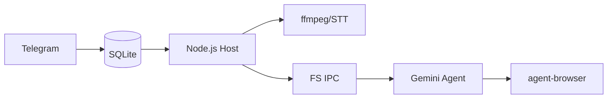

<p align="center">
  
</p>

<p align="center">
  <strong>Gemini CLI</strong> で動作する個人用AIアシスタント。コンテナ内で安全に実行。軽量で理解しやすく、カスタマイズ可能。
</p>

<p align="center">
  <em><a href="https://github.com/gavrielc/nanoclaw">NanoClaw</a> からフォーク - Claude Agent SDK を Gemini CLI に、WhatsApp を Telegram に置き換え</em>
</p>

<p align="center">
  <a href="README.md">English</a> |
  <a href="README.zh-TW.md">繁體中文</a> |
  <a href="README.zh-CN.md">简体中文</a> |
  <a href="README.es.md">Español</a> |
  <strong>日本語</strong>
</p>

## なぜ NanoGemClaw？

**NanoGemClaw** は、隔離されたコンテナ内で **Gemini CLI** を実行する、軽量で安全、かつカスタマイズ可能な AI アシスタントです。

| 機能 | NanoClaw | NanoGemClaw |
|------|----------|-------------|
| **エージェントランタイム** | Claude Agent SDK | Gemini CLI |
| **メッセージング** | WhatsApp (Baileys) | Telegram Bot API |
| **コスト** | Claude Max ($100/月) | 無料枠 (60リクエスト/分) |
| **メディアサポート** | テキストのみ | 写真、音声、オーディオ、動画、ドキュメント |
| **Web 閲覧** | 検索のみ | フル `agent-browser` (Playwright) |
| **高度なツール** | - | STT (音声文字起こし), 画像生成, Webhooks |

---

## 🚀 主な機能

- **マルチモーダル I/O** - 写真、ボイスメッセージ、動画、ドキュメントを送信。Gemini がネイティブに処理します。
- **音声文字起こし (STT)** - ボイスメッセージを自動的に文字起こしし、エージェントが分析します。
- **画像生成** - **Imagen 3** を使用して画像を生成するようエージェントに依頼できます。
- **ブラウザ自動化** - エージェントは `agent-browser` を使用して、複雑な Web タスク（操作、スクリーンショット）を実行します。
- **マルチターンタスク追跡** - 複雑な多段階のバックグラウンドタスクを追跡・管理します。
- **パーソナリティのカスタマイズ** - `/admin persona` を介して、ボットの性格や動作を定義できます。
- **多言語サポート (i18n)** - 日本語、繁体字中国語、簡体字中国語、英語、スペイン語をフルサポート。
- **コンテナ分離** - すべてのグループは独自のサンドボックス（Apple Container または Docker）で実行されます。

---

## 🛠️ インストール

### 前提条件

| ツール | 用途 | インストール |
|--------|------|--------------|
| **Node.js 20+** | ロジックエンジン | [nodejs.org](https://nodejs.org) |
| **Gemini CLI** | AI エージェントコア | `npm install -g @google/gemini-cli` |
| **FFmpeg** | オーディオ処理 | `brew install ffmpeg` (STT に必要) |

### クイックスタート

1. **クローンとインストール:**

   ```bash
   git clone https://github.com/Rlin1027/NanoGemClaw.git
   cd NanoGemClaw
   npm install
   ```

2. **ボットの設定:**
   - Telegram の **@BotFather** からトークンを取得します。
   - `.env.example` を参考に `.env` ファイルを作成します。
   - `npm run setup:telegram` を実行して検証します。

3. **ビルドと実行:**

   ```bash
   cd container && ./build.sh && cd ..
   npm run dev
   ```

---

## 📖 使用例

### メッセージングと生産性

- `@Andy このボイスメッセージを翻訳して要約して`
- `@Andy 未来的なサイバーパンク都市の 16:9 の画像を生成して`
- `@Andy https://news.google.com を閲覧して、主要な見出しを教えて`

### タスク自動化

- `@Andy 毎朝午前 8 時に天気をチェックして、服装を提案して`
- `@Andy 私の Web サイトを監視し、ダウンした場合は Webhook 通知を送信して`

---

## ⚙️ 管理

ボットに直接以下のコマンドを送信します：

- `/admin language <lang>` - ボットのインターフェース言語を切り替えます。
- `/admin persona <name>` - ボットのパーソナリティ設定を変更します。
- `/admin report` - 日次の活動概要レポートを取得します。

---

## 🏗️ アーキテクチャ



- **ホスト (Node.js)**: Telegram API、STT 轉換、コンテナのライフサイクルを処理します。
- **コンテナ (Alpine)**: Gemini CLI を実行します。`agent-browser` を介してインターネットにアクセスします。ホストから分離されています。
- **永続化**: タスクの保存には SQLite、セッションと状態の保存には JSON を使用します。

---

## 🛠️ トラブルシューティング

- **ボットが応答しない？** `npm run logs` を確認し、ボットがグループの管理者であることを確認してください。
- **STT が失敗する？** ホストシステムに `ffmpeg` がインストールされていることを確認してください (`brew install ffmpeg`)。
- **メディアを処理できない？** `.env` に `GEMINI_API_KEY` が設定されているか確認してください。
- **コンテナの問題？** `./container/build.sh` を実行して、最新のイメージが準備されているか確認してください。

---

## 授権

MIT

## クレジット

- 原始 [NanoClaw](https://github.com/gavrielc/nanoclaw) by [@gavrielc](https://github.com/gavrielc)
- 由 [Gemini CLI](https://github.com/google-gemini/gemini-cli) 驅動
