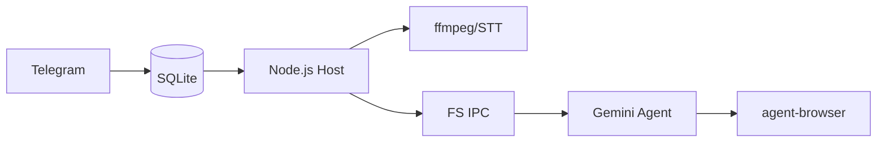

<p align="center">
  
</p>

<p align="center">
  Personal AI assistant powered by <strong>Gemini CLI</strong>. Runs securely in containers. Lightweight and built to be understood and customized.
</p>

<p align="center">
  <em>Forked from <a href="https://github.com/gavrielc/nanoclaw">NanoClaw</a> - replaced Claude Agent SDK with Gemini CLI and WhatsApp with Telegram</em>
</p>

<p align="center">
  <strong>English</strong> |
  <a href="README.zh-TW.md">繁體中文</a> |
  <a href="README.zh-CN.md">简体中文</a> |
  <a href="README.es.md">Español</a> |
  <a href="README.ja.md">日本語</a>
</p>

## Why NanoGemClaw?

**NanoGemClaw** is a lightweight, secure, and customizable AI assistant that runs **Gemini CLI** in isolated containers.

| Feature | NanoClaw | NanoGemClaw |
|---------|----------|-------------|
| **Agent Runtime** | Claude Agent SDK | Gemini CLI |
| **Messaging** | WhatsApp (Baileys) | Telegram Bot API |
| **Cost** | Claude Max ($100/mo) | Free tier (60 req/min) |
| **Media Support** | Text only | Photo, Voice, Audio, Video, Document |
| **Web Browsing** | Search only | Full `agent-browser` (Playwright) |
| **Advanced Tools** | - | STT, Image Gen, Webhooks |

---

## 🚀 Key Features

- **Multi-modal I/O** - Send photos, voice messages, videos, or documents. Gemini processes them natively.
- **Speech-to-Text (STT)** - Voice messages are automatically transcribed and analyzed.
- **Image Generation** - Ask the agent to create images using **Imagen 3**.
- **Browser Automation** - Agents use `agent-browser` for complex web tasks (interaction, screenshots).
- **Multi-turn Task Tracking** - Track and manage complex, multi-step background tasks.
- **Persona Customization** - Define your bot's personality and behavior via `/admin persona`.
- **i18n Support** - Full interface support for English, Chinese, Japanese, and Spanish.
- **Container Isolation** - Every group runs in its own sandbox (Apple Container or Docker).

---

## 🛠️ Installation

### Prerequisites

| Tool | Purpose | Installation |
|------|---------|--------------|
| **Node.js 20+** | Logic engine | [nodejs.org](https://nodejs.org) |
| **Gemini CLI** | AI Agent Core | `npm install -g @google/gemini-cli` |
| **FFmpeg** | Audio processing | `brew install ffmpeg` (Required for STT) |

### Quick Start

1. **Clone & Install:**

   ```bash
   git clone https://github.com/Rlin1027/NanoGemClaw.git
   cd NanoGemClaw
   npm install
   ```

2. **Configure Bot:**
   - Get a token from **@BotFather** on Telegram.
   - Create `.env` based on `.env.example`.
   - Run `npm run setup:telegram` to verify.

3. **Build & Run:**

   ```bash
   cd container && ./build.sh && cd ..
   npm run dev
   ```

---

## 📖 Usage Examples

### Messaging & Productivity

- `@Andy translate this voice message and summarize it`
- `@Andy generate a 16:9 image of a futuristic cyberpunk city`
- `@Andy browse https://news.google.com and give me the top headlines`

### Task Automation

- `@Andy every morning at 8am, check the weather and suggest what to wear`
- `@Andy monitor my website and send a webhook notification if it goes down`

---

## ⚙️ Administration

Send these commands directly to the bot:

- `/admin language <lang>` - Switch bot interface language.
- `/admin persona <name>` - Change bot personality.
- `/admin report` - Get a daily activity summary.

---

## 🏗️ Architecture



- **Host (Node.js)**: Handles Telegram API, STT conversion, and container lifecycle.
- **Container (Alpine)**: Runs Gemini CLI. Accesses internet via `agent-browser`. Isolated from host.
- **Persistence**: SQLite for turns/tasks; JSON for sessions/state.

---

## 🛠️ Troubleshooting

- **Bot not responding?** Check `npm run logs` and ensure the bot is an Admin in the group.
- **STT failing?** Ensure `ffmpeg` is installed on your host system (`brew install ffmpeg`).
- **Media not processing?** Verify your `GEMINI_API_KEY` is set in `.env`.
- **Container issues?** Run `./container/build.sh` to ensure the latest image is ready.

---

## License

MIT

## Credits

- Original [NanoClaw](https://github.com/gavrielc/nanoclaw) by [@gavrielc](https://github.com/gavrielc)
- Powered by [Gemini CLI](https://github.com/google-gemini/gemini-cli)
