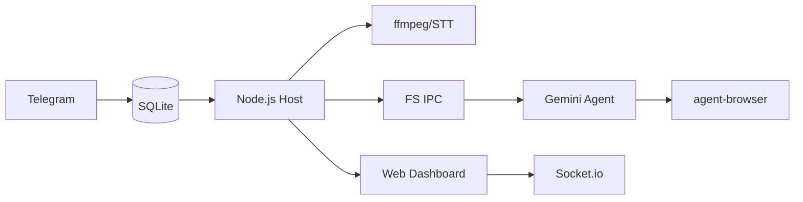

<p align="center">
  
</p>

<p align="center">
  由 <strong>Gemini CLI</strong> 驱动的个人 AI 助手。在容器中安全运行，轻量且易于理解和自定义。
</p>

<p align="center">
  <em>Fork 自 <a href="https://github.com/gavrielc/nanoclaw">NanoClaw</a> - 将 Claude Agent SDK 替换为 Gemini CLI，WhatsApp 替换为 Telegram</em>
</p>

<p align="center">
  <a href="README.md">English</a> |
  <a href="README.zh-TW.md">繁體中文</a> |
  <strong>简体中文</strong> |
  <a href="README.es.md">Español</a> |
  <a href="README.ja.md">日本語</a>
</p>

## 为什么选择 NanoGemClaw？

**NanoGemClaw** 是一个轻量、安全且可自定义的 AI 助手，在隔离的容器中运行 **Gemini CLI**。

| 功能 | NanoClaw | NanoGemClaw |
|------|----------|-------------|
| **Agent 运行时** | Claude Agent SDK | Gemini CLI |
| **消息平台** | WhatsApp (Baileys) | Telegram Bot API |
| **费用** | Claude Max ($100/月) | 免费方案 (60 次/分钟) |
| **多媒体支持** | 仅文字 | 图片、语音、音频、视频、文档 |
| **网页浏览** | 仅搜索 | 完整 `agent-browser` (Playwright) |
| **进阶工具** | - | STT, 图片生成, Webhooks, Web 监控面板 |

---

## 🚀 核心功能

- **多模态 I/O** - 发送图片、语音消息、视频或文档，Gemini 会直接处理。
- **语音转文字 (STT)** - 语音消息会自动转录并由 Agent 进行分析。
- **图片生成** - 要求 Agent 使用 **Imagen 3** 创建图片。
- **浏览器自动化** - Agent 使用 `agent-browser` 处理复杂网页任务（交互、截图）。
- **多轮任务追踪** - 追踪并管理复杂的多步骤背景任务。
- **人格定义 (Persona)** - 通过 `/admin persona` 定义机器人的个性和行为。
- **多语言支持 (i18n)** - 界面完整支持繁中、简中、英文、日文及西班牙文。
- **容器隔离** - 每个群组在各自的沙盒（Apple Container 或 Docker）中运行。
- **Web 监控面板** - 实时监控指挥中心，内置 Log 流式传输、Prompt 编辑器及系统配置管理。支持局域网访问。

---

## 🛠️ 安装说明

### 前置要求

| 工具 | 用途 | 安装方式 |
|------|------|----------|
| **Node.js 20+** | 逻辑引擎 | [nodejs.org](https://nodejs.org) |
| **Gemini CLI** | AI Agent 核心 | `npm install -g @google/gemini-cli` |
| **FFmpeg** | 音频处理 | `brew install ffmpeg` (STT 必需) |

### 快速开始

1. **Clone 与安装：**

   ```bash
   git clone https://github.com/Rlin1027/NanoGemClaw.git
   cd NanoGemClaw
   npm install
   ```

2. **配置 Bot：**
   - 在 Telegram 向 **@BotFather** 获取 Token。
   - 根据 `.env.example` 创建 `.env`。
   - 运行 `npm run setup:telegram` 验证。

3. **构建 Dashboard：**

   ```bash
   cd dashboard && npm install && cd ..
   npm run build:dashboard
   ```

4. **构建 Agent 容器：**

   ```bash
   bash container/build.sh
   ```

5. **启动：**

   ```bash
   npm run dev
   ```

   打开 `http://localhost:3000` 访问 Web 监控面板。

---

## 🔧 环境变量

| 变量 | 必填 | 说明 |
|------|------|------|
| `TELEGRAM_BOT_TOKEN` | 是 | 从 @BotFather 获取的 Bot Token |
| `GEMINI_API_KEY` | 否 | API 密钥（若未使用 OAuth） |
| `DASHBOARD_HOST` | 否 | 面板绑定地址（默认：`127.0.0.1`，局域网使用 `0.0.0.0`） |
| `DASHBOARD_API_KEY` | 否 | 保护面板访问的 API 密钥 |
| `WEBHOOK_URL` | 否 | 外部错误通知 Webhook（Slack/Discord） |

---

## 📖 使用示例

### 消息处理与生产力

- `@Andy 翻译这段语音消息并摘要`
- `@Andy 生成一张 16:9 的未来赛博朋克城市图片`
- `@Andy 浏览 https://news.google.com 并告诉我今日头条`

### 任务自动化

- `@Andy 每天早上 8 点检查天气并建议穿搭`
- `@Andy 监控我的网站，如果断线请发送 Webhook 通知`

---

## ⚙️ 管理控制

直接对机器人发送以下指令：

- `/admin language <lang>` - 切换机器人界面语言。
- `/admin persona <name>` - 变更机器人人格设置。
- `/admin report` - 获取每日活动摘要报告。

---

## 🏗️ 架构设计



- **宿主机 (Node.js)**：处理 Telegram API、STT 转换及容器生命周期。
- **容器 (Alpine)**：运行 Gemini CLI。通过 `agent-browser` 访问网络。与宿主机隔离。
- **持久化**：使用 SQLite 存储任务；JSON 存储 Session 与状态。
- **监控面板 (React)**：实时监控 SPA，内置 Log 流式传输、Prompt 编辑及系统配置。通过 REST API 及 Socket.io 通信。

---

## 🖥️ Web 监控面板

NanoGemClaw 内置实时 Web 监控面板，用于监控与管理系统。

### 访问方式

```bash
# 本地访问（默认）
open http://localhost:3000

# 局域网访问
DASHBOARD_HOST=0.0.0.0 npm run dev
```

### 功能模块

| 模块 | 说明 |
|------|------|
| **总览** | 群组状态卡片，显示实时 Agent 活动 |
| **日志** | 实时 Log 流式传输，支持级别筛选与搜索 |
| **记忆工作室** | 编辑系统提示词 (GEMINI.md)，查看对话摘要 |
| **设置** | 切换维护模式、Debug 日志、查看密钥状态 |

### 生产环境构建

```bash
npm run build:dashboard    # 构建前端
npm run build              # 构建后端
npm start                  # 在 :3000 提供面板服务
```

---

## 🛠️ 问题排解

- **机器人无响应？** 检查 `npm run logs` 并确认机器人已设为群组管理员。
- **STT 失败？** 确认宿主机已安装 `ffmpeg` (`brew install ffmpeg`)。
- **无法处理多媒体？** 确认 `.env` 中的 `GEMINI_API_KEY` 已正确设置。
- **容器问题？** 执行 `./container/build.sh` 确保镜像为最新版本。
- **Dashboard 空白页面？** 确认已运行 `cd dashboard && npm install`。Dashboard 有独立的 `package.json`。
- **Dashboard CORS 错误？** Dashboard origin 必须在允许列表中。检查 `DASHBOARD_ORIGINS` 环境变量或更新 `src/server.ts`。
- **容器 EROFS 错误？** Apple Container 不支持嵌套挂载覆盖。确认 `~/.gemini` 以 read-write 方式挂载。
- **Session 恢复失败？** 运行 `echo "{}" > data/sessions.json` 清除旧 session 并重启。

## 常见问题

| 问题 | 解决方案 |
|------|----------|
| `container: command not found` | 安装 Apple Container 或 Docker |
| Bot 无响应 | 确认 Bot 是群组管理员、Token 正确 |
| `Gemini CLI not found` | 运行 `npm install -g @google/gemini-cli` |
| OAuth 失败 | 运行 `gemini` 重新登录 |

## 许可证

MIT

## 致谢

- 原始 [NanoClaw](https://github.com/gavrielc/nanoclaw) 由 [@gavrielc](https://github.com/gavrielc) 开发
- 由 [Gemini CLI](https://github.com/google-gemini/gemini-cli) 驱动
