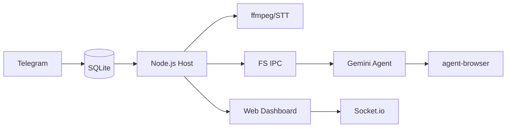

<p align="center">
  
</p>

<p align="center">
  由 <strong>Gemini CLI</strong> 驅動的個人 AI 助手。在容器中安全運行，輕量且易於理解和自訂。
</p>

<p align="center">
  <em>Fork 自 <a href="https://github.com/gavrielc/nanoclaw">NanoClaw</a> - 將 Claude Agent SDK 替換為 Gemini CLI，WhatsApp 替換為 Telegram</em>
</p>

<p align="center">
  <a href="README.md">English</a> |
  <strong>繁體中文</strong> |
  <a href="README.zh-CN.md">简体中文</a> |
  <a href="README.es.md">Español</a> |
  <a href="README.ja.md">日本語</a>
</p>

## 為什麼選擇 NanoGemClaw？

**NanoGemClaw** 是一個輕量、安全且可自訂的 AI 助手，在隔離的容器中執行 **Gemini CLI**。

| 功能 | NanoClaw | NanoGemClaw |
|------|----------|-------------|
| **Agent 運行時** | Claude Agent SDK | Gemini CLI |
| **訊息平台** | WhatsApp (Baileys) | Telegram Bot API |
| **費用** | Claude Max ($100/月) | 免費方案 (60 次/分鐘) |
| **多媒體支援** | 僅文字 | 圖片、語音、音訊、影片、文件 |
| **網頁瀏覽** | 僅搜尋 | 完整 `agent-browser` (Playwright) |
| **進階工具** | - | STT, 圖片生成, Webhooks, Web 監控面板 |

---

## 🚀 核心功能

- **多模態 I/O** - 傳送圖片、語音訊息、影片或文件，Gemini 會直接處理。
- **語音轉文字 (STT)** - 語音訊息會自動轉錄並由 Agent 進行分析。
- **圖片生成** - 要求 Agent 使用 **Imagen 3** 建立圖片。
- **瀏覽器自動化** - Agent 使用 `agent-browser` 處理複雜網頁任務（互動、截圖）。
- **多輪任務追蹤** - 追蹤並管理複雜的多步驟背景任務。
- **人格定義 (Persona)** - 透過 `/admin persona` 定義機器人的個性和行為。
- **多語言支援 (i18n)** - 介面完整支援繁中、簡中、英文、日文及西班牙文。
- **容器隔離** - 每個群組在各自的沙盒（Apple Container 或 Docker）中執行。
- **Web 監控面板** - 即時監控指揮中心，內建 Log 串流、Prompt 編輯器及系統設定管理。支援 LAN 存取。

---

## 🛠️ 安裝說明

### 前置需求

| 工具 | 用途 | 安裝方式 |
|------|------|----------|
| **Node.js 20+** | 邏輯引擎 | [nodejs.org](https://nodejs.org) |
| **Gemini CLI** | AI Agent 核心 | `npm install -g @google/gemini-cli` |
| **FFmpeg** | 音訊處理 | `brew install ffmpeg` (STT 必需) |

### 快速開始

1. **Clone 與安裝：**

   ```bash
   git clone https://github.com/Rlin1027/NanoGemClaw.git
   cd NanoGemClaw
   npm install
   ```

2. **設定 Bot：**
   - 在 Telegram 向 **@BotFather** 取得 Token。
   - 根據 `.env.example` 建立 `.env`。
   - 執行 `npm run setup:telegram` 驗證。

3. **建置 Dashboard：**

   ```bash
   cd dashboard && npm install && cd ..
   npm run build:dashboard
   ```

4. **建置 Agent 容器：**

   ```bash
   bash container/build.sh
   ```

5. **啟動：**

   ```bash
   npm run dev
   ```

   開啟 `http://localhost:3000` 存取 Web 監控面板。

---

## 🔧 環境變數

| 變數 | 必填 | 說明 |
|------|------|------|
| `TELEGRAM_BOT_TOKEN` | 是 | 從 @BotFather 取得的 Bot Token |
| `GEMINI_API_KEY` | 否 | API 金鑰（若未使用 OAuth） |
| `DASHBOARD_HOST` | 否 | 面板綁定位址（預設：`127.0.0.1`，LAN 使用 `0.0.0.0`） |
| `DASHBOARD_API_KEY` | 否 | 保護面板存取的 API 金鑰 |
| `WEBHOOK_URL` | 否 | 外部錯誤通知 Webhook（Slack/Discord） |

---

## 📖 使用範例

### 訊息處理與生產力

- `@Andy 翻譯這段語音訊息並摘要`
- `@Andy 生成一張 16:9 的未來網路龐克城市圖片`
- `@Andy 瀏覽 https://news.google.com 並告訴我今日頭條`

### 任務自動化

- `@Andy 每天早上 8 點檢查天氣並建議穿搭`
- `@Andy 監控我的網站，如果斷線請發送 Webhook 通知`

---

## ⚙️ 管理控制

直接對機器人發送以下指令：

- `/admin language <lang>` - 切換機器人介面語言。
- `/admin persona <name>` - 變更機器人人格設定。
- `/admin report` - 取得每日活動摘要報告。

---

## 🏗️ 架構設計



- **宿主機 (Node.js)**：處理 Telegram API、STT 轉換及容器生命週期。
- **容器 (Alpine)**：執行 Gemini CLI。透過 `agent-browser` 存取網路。與宿主機隔離。
- **持久化**：使用 SQLite 儲存任務；JSON 儲存 Session 與狀態。
- **監控面板 (React)**：即時監控 SPA，內建 Log 串流、Prompt 編輯及系統設定。透過 REST API 及 Socket.io 通訊。

---

## 🖥️ Web 監控面板

NanoGemClaw 內建即時 Web 監控面板，用於監控與管理系統。

### 存取方式

```bash
# 本地存取（預設）
open http://localhost:3000

# LAN 存取
DASHBOARD_HOST=0.0.0.0 npm run dev
```

### 功能模組

| 模組 | 說明 |
|------|------|
| **總覽** | 群組狀態卡片，顯示即時 Agent 活動 |
| **日誌** | 即時 Log 串流，支援等級篩選與搜尋 |
| **記憶工作室** | 編輯系統提示詞 (GEMINI.md)，檢視對話摘要 |
| **設定** | 切換維護模式、Debug 日誌、檢視密鑰狀態 |

### 生產環境建置

```bash
npm run build:dashboard    # 建置前端
npm run build              # 建置後端
npm start                  # 在 :3000 提供面板服務
```

---

## 🛠️ 問題排解

- **機器人無回應？** 檢查 `npm run logs` 並確認機器人已設為群組管理員。
- **STT 失敗？** 確認宿主機已安裝 `ffmpeg` (`brew install ffmpeg`)。
- **無法處理多媒體？** 確認 `.env` 中的 `GEMINI_API_KEY` 已正確設定。
- **容器問題？** 執行 `./container/build.sh` 確保映像檔為最新版本。
- **Dashboard 空白頁面？** 確認已執行 `cd dashboard && npm install`。Dashboard 有獨立的 `package.json`。
- **Dashboard CORS 錯誤？** Dashboard origin 必須在允許清單中。檢查 `DASHBOARD_ORIGINS` 環境變數或更新 `src/server.ts`。
- **容器 EROFS 錯誤？** Apple Container 不支援巢狀掛載覆蓋。確認 `~/.gemini` 以 read-write 方式掛載。
- **Session 恢復失敗？** 執行 `echo "{}" > data/sessions.json` 清除舊 session 並重啟。

## 常見問題排解

| 問題 | 解決方案 |
|------|----------|
| `container: command not found` | 安裝 Apple Container 或 Docker |
| Bot 無回應 | 確認 Bot 是群組管理員、Token 正確 |
| `Gemini CLI not found` | 執行 `npm install -g @google/gemini-cli` |
| OAuth 失敗 | 執行 `gemini` 重新登入 |

## 授權

MIT

## 致謝

- 原始 [NanoClaw](https://github.com/gavrielc/nanoclaw) 由 [@gavrielc](https://github.com/gavrielc) 開發
- 由 [Gemini CLI](https://github.com/google-gemini/gemini-cli) 驅動
